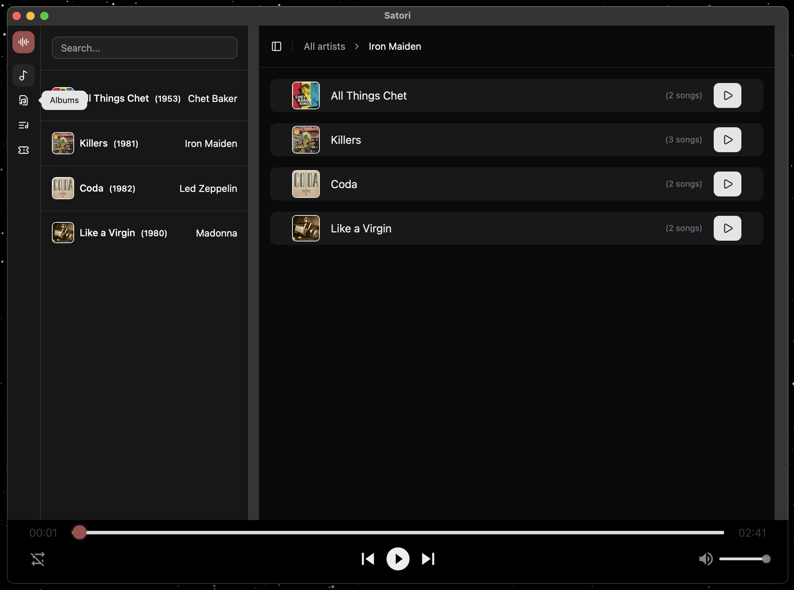

# MUSIC APP PROJECT

## Satori music

**A simple audio player application**<br/>



### Description

A simple audio player for playing music, and exposing saved catalogues/playlists for browsing. It's being built as a native desktop app for the fun of learning and convenient personal use. When it is up and running, I plan to make a web version of the app--hopefully that can work with a shared backend logic. My goal will be using the adapter pattern to interact with multiple music providers, by translating their APIs into a common interface that's easier to maintain.

---

### Workspace structure

This is project is maintained as a monorepo. So all parts of the application live in this repository. I find it easier to share the API logic etc between the web and native apps, keeping dependencies in sync and being able to test both side by side.

```bash
music-project/
├── Satori
│ └── src             / frontend
│   └── app           / gui
│   └── assets        / static
│   └── components    / reusable bits
│   └── css           / styles
│   └── lib
│      └── api        / external content
│      └── data       / sample content
│      └── utils
│ └── src-tauri       / backend
│ └── packages/config
└── README.md
```

## Build and Tools

**languages**

- JavaScript/Typescript (frontend)
- HTML/CSS (frontend)
- Rust (backend)

**frameworks/tools**

- React
- Tauri
- Vite
- Tailwind
- shadcn (components)

### Audio player

Built with
[react-h5-audioplayer](https://www.npmjs.com/package/react-h5-audio-player/v/2.3.2)
and custom [styles](src/css/audioplayer/README.md)

## Install dependencies and run application

### Prerequisites

To run this app locally, install or check your latest versions:

- Node.js
- npm
- Rust (for building the native app)
- Tauri CLI

```bash
cargo install create-tauri-app
```

Install all the dependencies:

```bash
npm install
```

---

**Run app**

```bash
npm run tauri dev server
```

This will automatically open the app window and all code changes can be seen live. The server will also start and you'll be able to write uploaded folder trees into artistsData.ts. **!NOTE! This will currently overwrite existing data.**

## Deployment and build

**Native**<br/>
The native desktop app is built using [Tauri](https://v2.tauri.app).

**Web** !NOT IMPLEMENTED!<br/>
The web version of this app is deployed using [Vercel](https://vercel.com/home).

## Contributions

As I am building this app for personal use and learning purposes, I'm not looking for contributions right now.<br/> This can change over time, so if you're really interested-please check back some other time.
